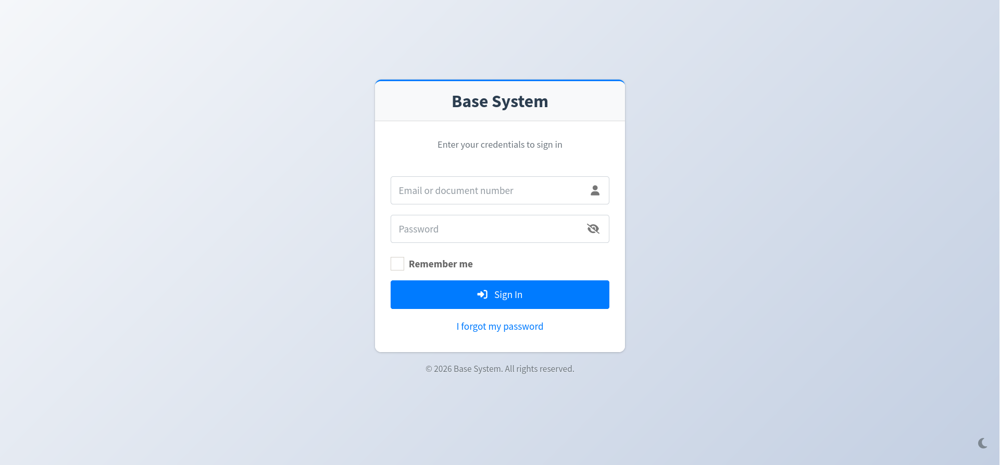
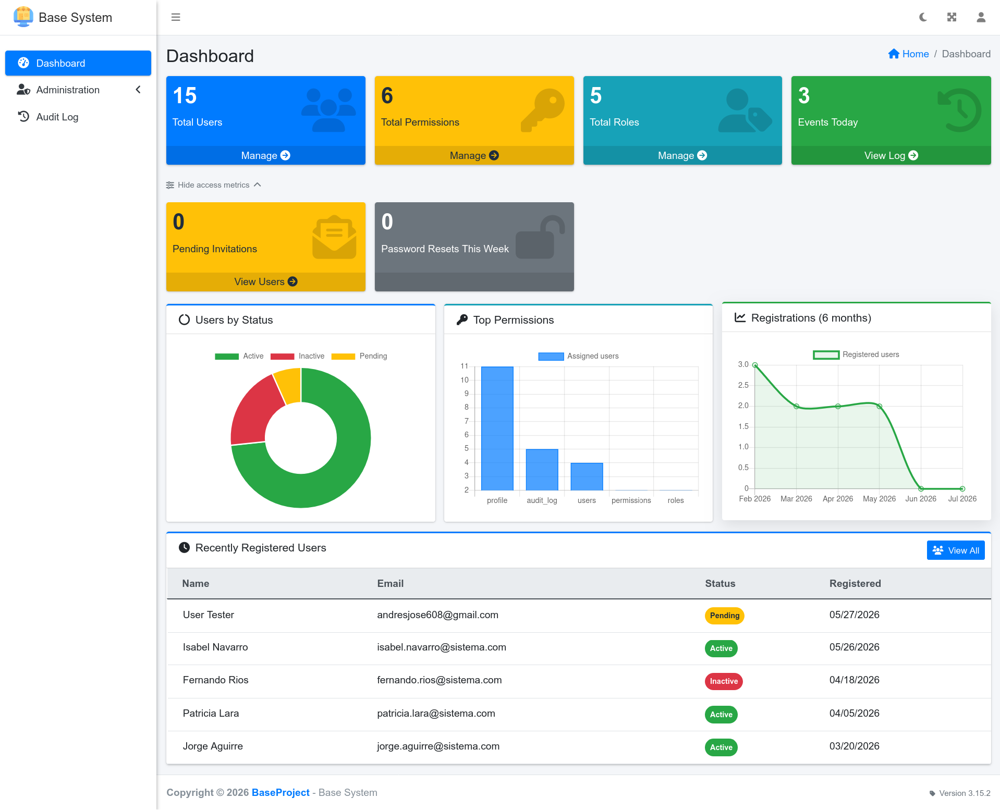
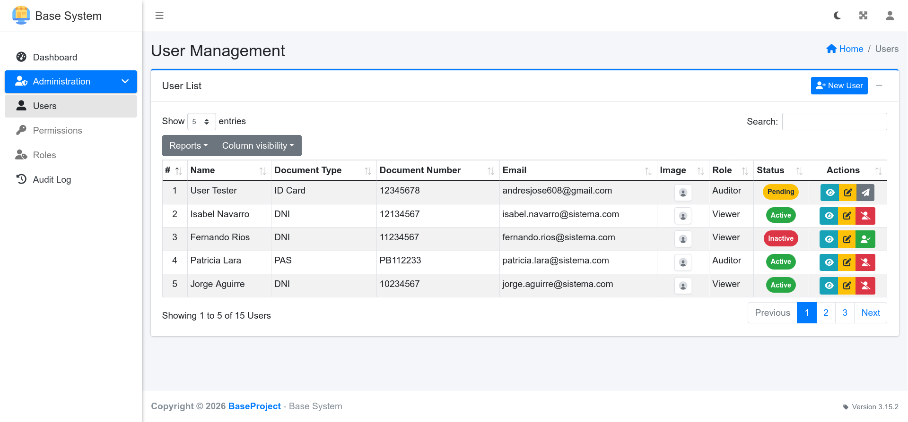
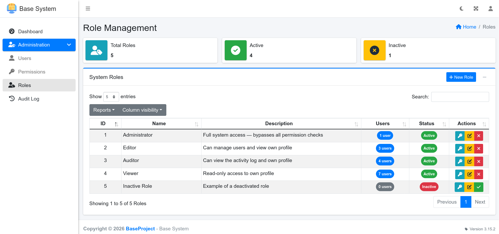

<div align="center">

# PHP MVC Admin Starter

[](https://php.net)
[](LICENSE)
[](CHANGELOG.md)
[](https://github.com/jandrescodes/php-mvc-admin-starter/actions/workflows/tests.yml)
[](CONTRIBUTING.md)
[](https://conventionalcommits.org)

A PHP starter template with authentication, user management, and role-based permission control. Built on a pure MVC architecture with a custom PSR-4 autoloader and Composer for dependency management.

> A solid starting point for PHP web applications that need a secure admin panel out of the box.

[Features](#features) •
[Installation](#installation) •
[Documentation](#developer-docs) •
[Contributing](#contributing) •
[License](#license)

</div>

## Table of Contents

- [PHP MVC Admin Starter](#php-mvc-admin-starter)
  - [Table of Contents](#table-of-contents)
  - [Features](#features)
  - [Screenshots](#screenshots)
    - [Login](#login)
    - [Dashboard](#dashboard)
    - [User Management](#user-management)
    - [Role \& Permissions](#role--permissions)
  - [Requirements](#requirements)
  - [Installation](#installation)
  - [Configuration `.env`](#configuration-env)
  - [Adding a New Module](#adding-a-new-module)
  - [Architecture](#architecture)
  - [Testing](#testing)
  - [Tech Stack](#tech-stack)
  - [Security](#security)
  - [Developer Docs](#developer-docs)
  - [AI Integration](#ai-integration)
  - [Contributing](#contributing)
  - [Changelog](#changelog)
  - [License](#license)

## Features

- **Secure authentication** — Login by email or document number, CSRF protection, anti-session hijacking, inactivity logout, persistent remember-me cookie, brute-force lockout
- **User management** — Full CRUD, profile images, account activation/deactivation, invitation by email (admin creates pending user → 48 h token link → user sets password → account activated)
- **Role management** — Role catalog with CRUD, role↔permission assignment UI, system-role protection (`is_system`), logical delete only
- **Permission control** — Two-level permission model: direct per-user assignments + role-inherited permissions (UNION, deduplicated); adaptive navigation menu; zero DB queries per check
- **Audit Log** — Append-only activity log for all admin actions (login, logout, user/role/permission CRUD); filterable by module, action, user, and date range; detail modal with human-readable key/value breakdown; export via DataTables; gated by `audit_log` permission
- **Metrics dashboard** — Chart.js charts (donut active/inactive/pending, bar, line) + stat cards for users, permissions, roles, and today's audit events; toggleable access-metrics row (pending invitations, resets this week) with localStorage persistence and CSS slide+fade animation; staggered entrance animations for stat cards and chart cards; session-based cache with event-driven invalidation
- **Custom error pages** — Styled 403, 404, and 500 error pages sharing one layout (`views/layouts/error.php`), WCAG AA-compliant color tokens, and full dark mode support
- **Composer-managed** — Native PSR-4 autoloading for `App\*`; Composer handles both autoloading and third-party packages
- **AdminLTE 3** — Production-ready responsive dashboard
- **PDF generation** — Built-in report generation with TCPDF
- **Dark mode** — system-aware toggle (moon/sun) in the navbar; preference stored in `localStorage`, falls back to `prefers-color-scheme`; anti-FOUC inline script prevents flash on reload; covers all modules, auth standalone pages, and error pages
- **Accessible by default** — labeled form inputs, `aria-pressed`/`aria-label` on icon-only toggles, `prefers-reduced-motion` respected, `<noscript>` fallback for flash messages
- **Full UI toolkit** — DataTables, Select2, SweetAlert2, Chart.js, jQuery Validate included

## Screenshots

### Login

Session-based login with brute-force lockout and remember-me support.



---

### Dashboard

Metrics overview with Chart.js charts and event-driven cache invalidation.



---

### User Management

Full CRUD with profile images, activation/deactivation, and email invitations.



---

### Role & Permissions

Role catalog with role↔permission assignment and system-role protection.



## Requirements

- PHP 8.2+ with **PDO** and **GD** extensions
- MySQL 5.7+ / MariaDB 10.4+
- Apache 2.4+ or Nginx

## Installation

```bash
# 1. Clone the repository
git clone https://github.com/jandrescodes/php-mvc-admin-starter.git
cd php-mvc-admin-starter

# 2. Install dependencies
composer install

# 3. Import the database
mysql -u root -p < database/schema.sql
mysql -u root -p < database/seeder.sql

# 4. Set up the environment
cp .env.example .env
# Edit .env with your credentials (see Configuration section)

# 5. Create the uploads directory
mkdir -p public/uploads/users
cp public/img/user_default.jpg public/uploads/users/
```

Open `http://localhost/php-mvc-admin-starter/` in your browser.

**Default credentials:** `admin@sistema.com` / `admin123`
⚠️ Change the default credentials immediately after installation.
For all seeded test users and their permissions, see [docs/SEEDING.md](docs/SEEDING.md).

## Configuration `.env`

```env
DB_HOST=localhost
DB_NAME=auth_base
DB_USER=root
DB_PASS=yourpassword
DB_CHARSET=utf8mb4

APP_URL=http://localhost/php-mvc-admin-starter/public
TIMEZONE=America/La_Paz
DEBUG=true
APP_VERSION=3.16.1

# Dashboard cache TTL in seconds (0 to disable)
DASHBOARD_CACHE_TTL=300

# Session & Remember Me
SESSION_LIFETIME=1800
REMEMBER_ME_LIFETIME=2592000
REMEMBER_ME_COOKIE_NAME=remember_me

# Login throttling
LOGIN_MAX_ATTEMPTS=5
LOGIN_LOCKOUT_MINUTES=15

# SMTP Configuration (Optional)
MAIL_HOST=smtp.gmail.com
MAIL_PORT=587
MAIL_USER=your_email@gmail.com
MAIL_PASS=your_app_password
MAIL_FROM=your_email@gmail.com
MAIL_FROM_NAME="Admin Starter"
```

## Adding a New Module

This project is designed to be extended. To add a module (e.g. `Products`):

1. **Controller** — Create `app/Controllers/ProductController.php` with namespace `App\Controllers`, extending `App\Core\Controller`
2. **Model** — Create `app/Models/Product.php` with namespace `App\Models`, extending `App\Core\Model`
3. **Views** — Create `views/products/index.php`, `create.php`, etc.
4. **Routes** — Add entries to `routes/web.php`:
   ```php
   ['method' => 'GET',  'path' => '/products',        'controller' => 'Product@index',  'middleware' => ['auth', 'perm:products']],
   ['method' => 'POST', 'path' => '/products',        'controller' => 'Product@store',  'middleware' => ['auth', 'perm:products']],
   ['method' => 'GET',  'path' => '/products/create', 'controller' => 'Product@create', 'middleware' => ['auth', 'perm:products']],
   ```
5. **Assets** — Add CSS to `public/css/modules/products/` and JS to `public/js/modules/products/`
6. **Permission** — Insert the permission into the `permissions` table in the database
7. **Menu** — Add the link in `views/layouts/sidebar.php` with a permission check:

```php
<?php if (\App\Core\Auth::hasPermission('products')): ?>
    <li class="nav-item">
        <a href="<?= URL ?>products" class="nav-link">Products</a>
    </li>
<?php endif; ?>
```

The autoloader automatically resolves any class whose namespace matches the directory structure.

## Architecture

```
app/
├── Config/       # Bootstrap: config.php, Connection.php (PDO singleton), phpdotenv init
├── Controllers/  # Feature controllers (flat — no subdirectories)
├── Core/         # Controller.php, Model.php, Router.php, Auth.php, AssetRegistry.php, ErrorHandler.php, helpers.php
├── Middleware/   # AuthMiddleware, GuestMiddleware, PermissionMiddleware
├── Models/       # App\Models
└── Services/     # App\Services (ImageService, MailService, DashboardCache, LoginThrottleService, AuditLogger)
routes/           # web.php — all route definitions
views/            # PHP templates; layouts/header.php, sidebar.php and footer.php wrap content
public/           # Static assets (lib/, core/, plugins/, modules/) + index.php (Front Controller)
vendor/           # Composer dependencies (not committed — run composer install)
```

**Request flow:** All HTTP requests are routed through `public/index.php` via Apache rewriting. `App\Core\Router` matches the URI and method against `routes/web.php`, runs declared middleware (auth, guest, perm:NAME), and dispatches to the controller method. Clean URLs like `/users`, `/users/5/edit`, `/permissions/3` replace the old direct-file access pattern.

## Testing

```bash
# Run all tests
vendor/bin/phpunit

# Unit tests only (no DB required, ~2 s)
vendor/bin/phpunit --testsuite=Unit

# Integration tests (requires a test DB — see below)
vendor/bin/phpunit --testsuite=Integration
```

**Test DB setup (one time):**

```bash
mysql -u root -p -e "CREATE DATABASE php_mvc_admin_starter_test CHARACTER SET utf8;"
cp .env.testing.example .env.testing
# Edit .env.testing with your local DB credentials
```

Tests run automatically on every push and PR via GitHub Actions (see `.github/workflows/tests.yml`).

## Tech Stack

| Layer        | Technology                                                    |
| ------------ | ------------------------------------------------------------- |
| Backend      | PHP 8.2, PDO, Composer (native PSR-4 autoloading)             |
| Dependencies | PHPMailer, TCPDF, phpdotenv (via Composer)                    |
| UI framework | AdminLTE 3, Bootstrap 4, FontAwesome                          |
| JavaScript   | jQuery, DataTables, Select2, SweetAlert2, Chart.js, Moment.js |
| Database     | MySQL / MariaDB                                               |
| Testing      | PHPUnit 11 (unit + integration suites, GitHub Actions CI)     |

## Security

- File uploads validated server-side with `finfo` MIME detection (never trusts `$_FILES['type']`); extension whitelist enforced; `public/uploads/users/.htaccess` blocks PHP execution as defense-in-depth
- Session flash messages (`$_SESSION['message']`, `$_SESSION['welcome_user']`) interpolated into JS via `json_encode()` — immune to `</script>` injection
- Passwords hashed with `password_hash()` (PASSWORD_DEFAULT), minimum 8 characters
- CSRF tokens on all forms and AJAX endpoints; token regenerated after every POST (including error paths on sensitive endpoints); destructive non-AJAX actions use POST routes, never GET
- Prepared statements for all SQL queries
- XSS prevention via `htmlspecialchars()` at the view layer on all output
- Session cookie flags: `httponly`, `SameSite=Lax`, `use_strict_mode`
- Session hijacking protection (IP and User-Agent validation)
- Session ID regeneration on every login and on every remember-me auto-login
- Remember-me cookie: `HttpOnly`, `SameSite=Lax`, `Secure` (HTTPS); token stored as SHA-256 hash, rotated on every use; revoked immediately when the associated account's password is changed (by the user or by an admin)
- Configurable session lifetime via `SESSION_LIFETIME` in `.env`
- Permission cache in session — navigation checks require zero DB queries per page load
- Users cannot deactivate or change the status of their own account
- Brute-force protection — account lockout after N failed login attempts (`LOGIN_MAX_ATTEMPTS`); lazy unlock by time or manual admin unlock; locked accounts bypass `password_verify` to prevent timing leaks

## Developer Docs

- [docs/SEEDING.md](docs/SEEDING.md) — seeded users, rerun behavior, and permission matrix
- [docs/ACCESS_CONTROL.md](docs/ACCESS_CONTROL.md) — session guards and permission cache flow
- [docs/AJAX_AND_MODULES.md](docs/AJAX_AND_MODULES.md) — AJAX endpoint and frontend module conventions
- [docs/TESTING.md](docs/TESTING.md) — test suites, DB setup, base classes, fixtures, and conventions

## AI Integration

This project is configured for AI coding assistants like Claude Code. It includes custom skills, MCP server templates, and auto-approval settings.
See [docs/AI_SETUP.md](docs/AI_SETUP.md) for full details on how to use and extend the AI configuration.

## Contributing

Contributions are welcome — bug reports, feature ideas, and pull requests alike.
See [CONTRIBUTING.md](CONTRIBUTING.md) for the full guide, including development setup, code standards, and the PR process.
We follow [Conventional Commits](https://conventionalcommits.org/) and [Semantic Versioning](https://semver.org/).

If you find this project useful, consider giving it a ⭐ on GitHub — it helps others discover it.

## Changelog

See [CHANGELOG.md](CHANGELOG.md) for the full change history.

## License

<div align="center">

MIT — see [LICENSE](LICENSE) for details.

</div>
